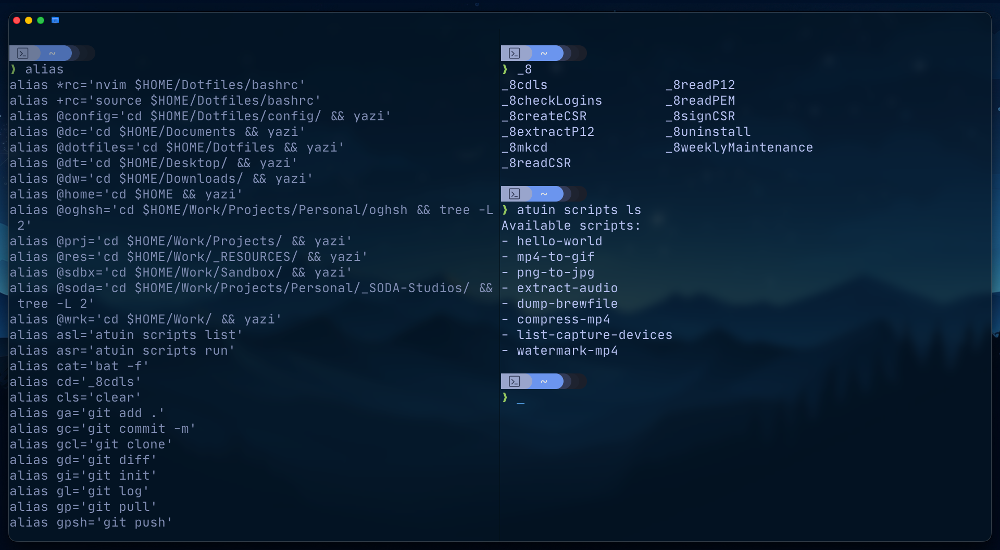

# Dotfiles

# This repo is

```
‼️ A highly opinionated collection of dotfiles for a macOS based workspace focused primarily on creative production (music & video) and software development.

'How productivity "feels"'' as well as aesthetic choices (theme customisations) are subjective. That said, I value tools that bring me joy and keep me in flow.
```

`#Notion`, `#Excalidraw`, `#Raycast`, `#VSCode`, `#Ghostty`

### Goal

> To provision a macOS workstation from scratch.

## 🗂️ Repository structure

```
TODO: Add project directory tree
```

# This repo offers

## 🍎 macOs utils

- macos system preferences
- a set of applications for productivity and working
  - installed with `brew` for a fully usable working computer workspace


## ⚙️ 0. Shell utitilities



//TODO: Create weekly backup job for ~/Work directory


# Installation process

`Note` that some of these changes require a logout/restart to take effect.

> 💡 TIP: To get started, close any open System Preferences panes, to prevent them from overriding settings we’re about to change

```bash
git submodule init
```

```bash
git submodule update
```

1. Start dotBot

```bash
./install
```

1. Step: macOS configuration

```bash
macos-config/macos-config.sh
```

1. Install brew & apps

```bash
macos-config/brew.sh
```

1. Link dotfiles

```bash

```

1. Configure development environment `dev-cfg/`

## Resources & thanks

[Josean Martinez - 7 Amazing CLI tools you need to try](https://www.youtube.com/watch?v=mmqDYw9C30I&t=615s)

## 💬 Contact

> <o@ogh.sh>

---
